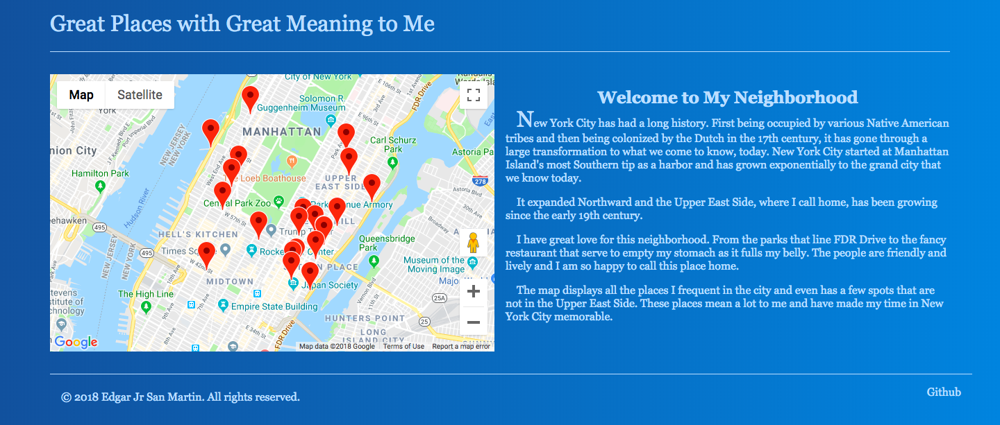

# NYC Memory Map
A static web page deployed to Heroku. Used minimal PHP to be able to properly deploy onto Heroku. This site was created so I could play around with the Google Maps API and display my favourite places to go to in NYC. Simple page but I enjoyed making it, I could improve on it by having the data for the Google Maps markers to be stored in a database, like SQL-lite or some place smaller while also creating a more secure backend to hide API keys. Could be seen [here](https://ues-memory-map.herokuapp.com/index.html)

